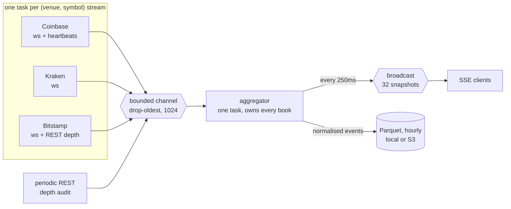

# market-aggregator

Multi-venue crypto market data ingest, normalisation and fan-out, in Rust and
tokio. Three venues, any number of symbols, one process.

The interesting problem in a market data feed is not throughput. It is that
**an order book with a missed delta is silently wrong**, and silently wrong is
worse than obviously down. A process that crashes gets noticed. A process that
serves confident prices from a book that quietly lost a message at 02:14 does
not, and everything downstream prices against a market that does not exist.

So the whole system is organised around one question:

> For every number we publish, can we say how much it should be believed?

---

## Try it without a network

The repository ships real recordings of all three venues. They replay through
the actual pipeline — the same parsers, books, aggregator, metrics and web page
a live run uses — with the network unplugged.

```bash
just demo tapes/2026-08-09-btc-usd-live.jsonl.gz
```

Two tapes, for different jobs:

| Tape | Length | What it is good for |
|---|---|---|
| `2026-08-09-btc-usd-live.jsonl.gz` | 3 min, 5827 frames | The default. Its touch moves — 114 distinct top-of-book states, 1.8 bps of range — so rolling indicators and the cross-venue view show real numbers. |
| `2026-08-09-btc-usd.jsonl.gz` | 60 s, 1503 frames | The original, kept because it is the recording that found the three parser bugs below. Its Coinbase touch never moves once across 49,940 level updates, so it exercises parsing and books but not anything derived over time. |

Then open <http://127.0.0.1:8080>. To connect to the live venues instead:

```bash
just serve coinbase,kraken,bitstamp BTC-USD,ETH-USD
```

Endpoints: `/` the page, `/events` SSE, `/metrics` Prometheus text,
`/api/snapshot` one JSON reading, `/health`.

Requires Rust 1.94+ and [`just`](https://github.com/casey/just). `just --list`
shows everything, grouped by whether it runs offline, touches a venue, or
touches AWS.

---

## The shape of it



**The aggregator owns every book, exclusively.** One task, no locks — not
because a `Mutex` would be slow at this scale, but because a lock makes it
*possible* to read one venue's book while another is mid-update, and eventually
someone does. The channel receiver is *moved* into the aggregator, so a second
one cannot be constructed.

**Crate boundaries are the proof, not the documentation.** `ma-core` has no
`tokio`, no `reqwest`, no I/O of any kind in its manifest — and a test fails the
build if one is ever added. "The book logic is unit-testable without a network"
is therefore checked by the compiler.

| Crate | Contains | May use |
|---|---|---|
| `ma-core` | `Book`, `MarketEvent`, `Price`, `IngestTime`, the depth audit | nothing async |
| `ma-venues` | wire formats, per-venue sync, endpoints as data | `serde` only |
| `ma-pipeline` | channel, ingest tasks, aggregator, raw-frame tape | `tokio` |
| `ma-persist` | Arrow schema, Parquet writer, `ObjectStore`, S3 | `arrow`, `parquet` |
| `ma-server` | axum SSE, `/metrics`, the page, the binaries | everything |

---

## Three venues, three different guarantees

This is the heart of the design. The venues do not merely differ in spelling;
they differ in **what they can prove about your book**.

| Venue | Snapshot from | Ordering field | Detects loss? | Verifies state? | `Integrity` |
|---|---|---|---|---|---|
| Bitstamp | REST only | `microtimestamp` | **No** | No | `OrderOnly` |
| Coinbase | the websocket | `sequence_num` | Yes | No | `GapDetectable` |
| Kraken | the websocket | *(none)* | No | **Yes** — CRC32 | `Verified` |

Kraken has no sequence number at all and is nonetheless the *strongest* of the
three: a checksum over the book you actually built validates the **resulting
state** rather than the path taken to it. A sequence number proves you received
every message; it says nothing about whether you applied them correctly.

So a book is never just "up". It is one of three things, and the third is the
one most systems miss:

```rust
Uninitialized                               // no data
Desynced { since, reason }                  // data I do not trust
Live { integrity, since, last_verified }    // data I trust, to a stated degree
```

`Integrity` is `Ord`, weakest first, so any view spanning venues takes the
minimum and reports the truth about the whole. The page does exactly that, in a
banner above the cards — a cross-venue spread that does not say "order-only at
best" is claiming more than the data supports.

---

## What live data taught, that a green test suite did not

The most useful thing this project produced. Every one of these passed a fully
green suite; all were found by recording real venue traffic or by watching a
live run.

**From the first recorded tape:**

1. Coinbase's `sequence_num` is scoped to the *connection*, not the channel —
   so every heartbeat read as a gap.
2. Coinbase says `offer`, not `ask`. Getting that wrong drops every ask update,
   leaves a one-sided book — and a one-sided book can never cross, so the
   last-resort crossed-book detector never fires either.
3. Kraken's `status` frame has no `symbol`, which broke an eagerly-typed
   envelope on the counter whose entire job is signalling schema drift.

**From running the v2 depth audit against live venues:**

4. A guard band counted in *levels* is not a distance. The top 50 levels of
   Coinbase BTC-USD span **2.4 basis points**; five levels in is 0.2 bps — well
   inside the churn the guard existed to exclude.
5. "Two mismatching audits in a row" is not evidence. Roughly 2% of levels in
   the 1–10 bps band disagree at any instant, so an audit comparing hundreds of
   levels finds *something* wrong nearly every time — at a different price each
   time. The rule became "the same *price* wrong on consecutive audits": noise
   moves, a lost delta does not.

**From killing a live run:**

6. Hourly Parquet *partitioning* is not hourly *durability*. A Parquet file is
   unreadable until its footer is written, and the process only handled Ctrl-C —
   so `SIGTERM`, which is what an orchestrator sends on every deploy, discarded
   everything since the last roll.

A fixture author writes the messages they are thinking about. A policy author
picks the units they are thinking in. Both are why
[`just record`](justfile) and [`just audit-probe`](justfile) exist.

---

## Things worth reading the code for

- **Backpressure with a stated policy.** The ingest channel is bounded and
  drops the *oldest* event, because a stale tick has negative value. This is
  the wrong answer for claims processing, and the code says so — the two places
  that take the opposite policy (the tape tee, and replay) are documented
  against it. Drops are counted; a silent drop policy is a bug.
- **Reconnect is a resync, not a pause.** Nothing resumes: Coinbase restarts
  its sequence numbers, Kraken resends a snapshot, Bitstamp sends nothing until
  a REST call lands. Session boundaries travel *in-band* so they land in the
  right place relative to the frames around them.
- **Detection and recovery live in different tasks.** The aggregator owns the
  books so only it can notice a gap; the ingest task owns the socket so only it
  can fix one. The signal between them is a `watch` counter, so requests
  coalesce instead of queueing into a self-inflicted reconnect storm.
- **Equal jitter, not full jitter.** Full jitter's best case is retrying
  immediately, and immediately is the wrong thing to do to a venue that just
  rate-limited you.
- **Two replay layers, neither replacing the other.** A raw-frame tape records
  *bytes* and can reproduce a parser bug; the Parquet archive records
  *normalised events*, covers hours, and is queryable — and still verifies
  rebuilt books against Kraken's own checksum.
- **`Decimal` everywhere, and prices serialise as JSON strings.** Kraken hashes
  the exact digits it sent, trailing zeros included. A JSON number would be an
  `f64` in every browser and would undo that at the last step; a test pins it.

The reasoning lives in **[`docs/DESIGN.md`](docs/DESIGN.md)** — sequence
diagrams, the decisions table with what was rejected and why, and an operating
runbook that says what to do when each metric moves.

---

## Status

v1 and v2 are complete: three venues, multi-symbol, full L2 depth, reconnect
with gap-fill, the periodic integrity audit, SSE and a page, metrics, and a
Parquet archive the process can replay itself from.

**235 tests, clippy-clean at `-D warnings`, and the whole suite runs offline.**

Deliberately unfinished, and stated rather than hidden:

- **S3 is written, compiles under `--features s3`, and has never been run
  against a bucket.** Nothing writes to S3 before an IAM user scoped to one
  bucket prefix exists. That is enforced three ways: the feature is off by
  default, a prefix is mandatory, and `MA_S3_ACK_SCOPED_IAM=1` is required to
  start — an assertion by the operator, not a verification, and its own error
  message says so.
- **No tape has been recorded across a real reconnect.** Both committed tapes
  are clean runs; every recorded session boundary count is zero. The reconnect
  path is proven against the scripted fake venue and, for the audit, against
  live venues — but not yet from a recording of a real outage.

Next: v3 — sharding across nodes, rolling indicators, and a cross-venue spread
view that must surface `Integrity` beside every number it derives, or it will
lie.

## Non-goals

**No Kafka** (ops burden without payoff at single-node scale). **No equities**
(paywalled; crypto is free and public). **No trading** — read-only, and no API
key with trade permission exists. **No AI features** — the point is the
concurrency story.
