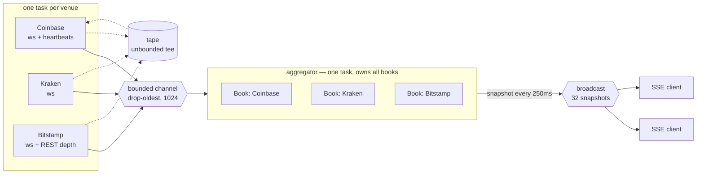
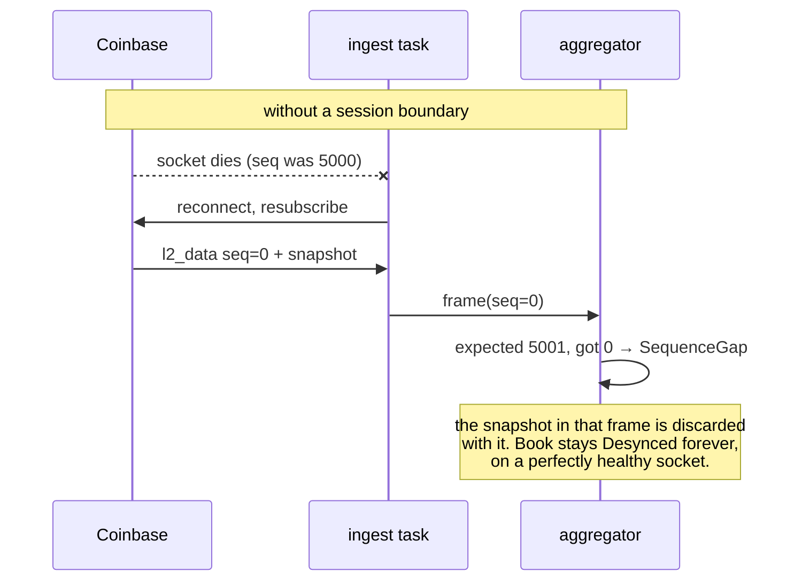
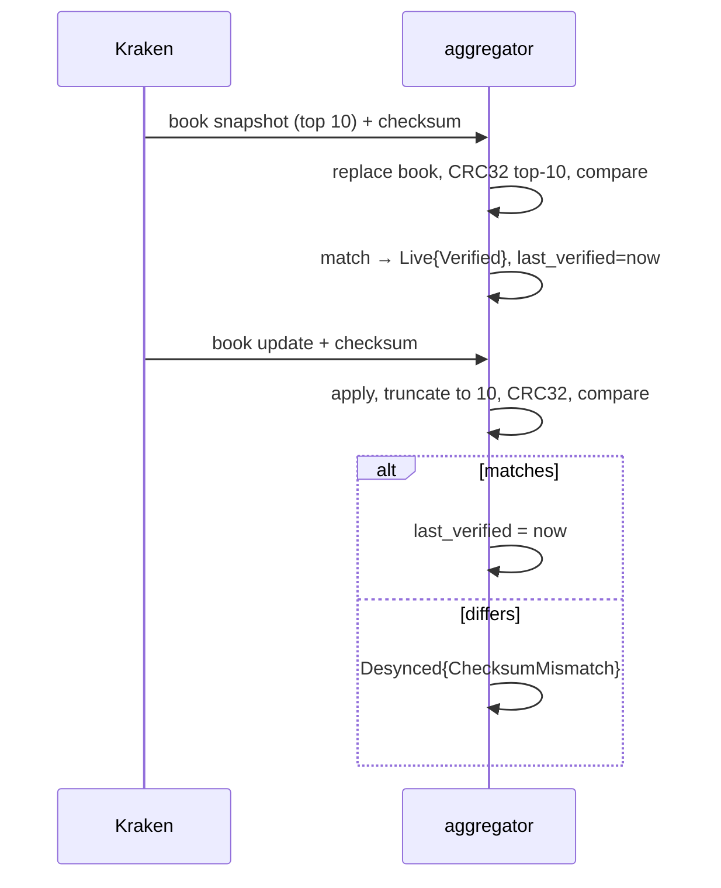
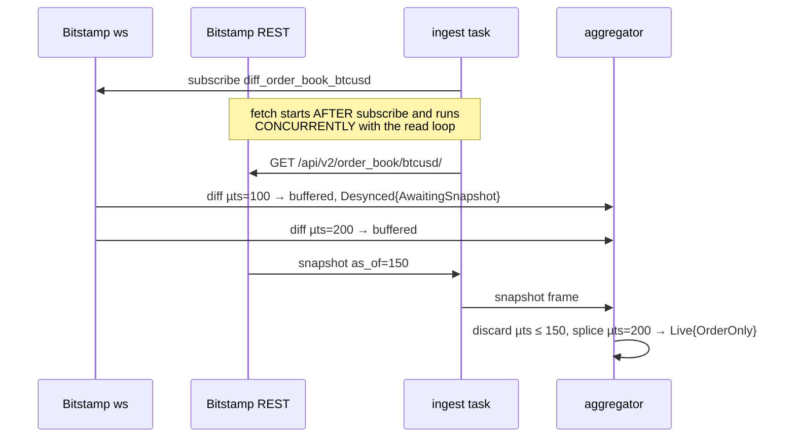
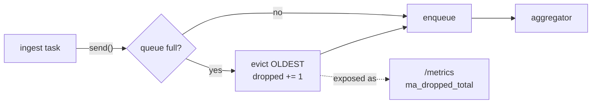
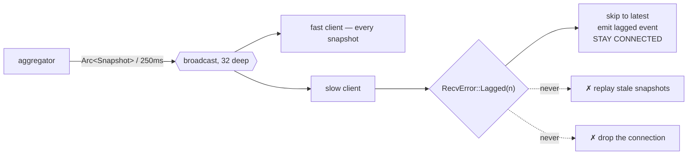

# market-aggregator — design and operation

Multi-venue crypto market data ingest, normalisation and fan-out, in Rust and
tokio. Three venues, one symbol, one process.

This document is the reasoning, not the API docs — `cargo doc` has those, and
the module headers carry the local arguments. What follows is the part that is
unrecoverable three weeks later: why the pieces are shaped the way they are,
and what to do when one of them starts misbehaving at 3am.

---

## 1. What this is, and what it refuses to be

The interesting problem in a market data feed is not throughput. It is that
**an order book with a missed delta is silently wrong**, and silently wrong is
worse than obviously down. A process that crashes gets noticed. A process that
serves confident prices from a book that quietly lost a message at 02:14 does
not, and everything downstream prices against a market that does not exist.

So the whole system is organised around one question: *for every number we
publish, can we say how much it should be believed?*

Deliberately out of scope:

- **No Kafka.** At single-node scale it is operational burden without
  pedagogic payoff.
- **No equities.** Real-time equity data is paywalled; crypto is free and
  public.
- **No trading.** Read-only, and no API keys with trade permission exist.
- **No AI.** The point is the concurrency story.

---

## 2. The concurrency story



**Ingest tasks own a socket and nothing else.** No shared state, no books, no
knowledge that other venues exist. Each one connects, subscribes, reads,
reconnects, and pushes bytes into the channel.

**The aggregator owns every book, exclusively.** One task, no locks. Not
because a `Mutex` would be slow at three venues — it would not — but because a
lock makes it *possible* to read one venue's book while another is mid-update,
and eventually someone does. Single ownership makes a torn cross-venue read
unrepresentable rather than merely unlikely, and the compiler enforces it: the
channel receiver is moved into the aggregator, so a second one cannot be
constructed.

**The crate boundary is the proof, not the documentation.** `ma-core` holds
the book and clock logic and has no `tokio`, no `reqwest`, no I/O of any kind
in its manifest. The claim "book logic is unit-testable without a network" is
therefore checked by the compiler, and `ma-core/tests/manifest.rs` fails the
build if an async dependency is ever added.

| Crate | Contains | May use |
|---|---|---|
| `ma-core` | `Book`, `MarketEvent`, `Price`, `IngestTime` | nothing async |
| `ma-venues` | wire formats, per-venue sync, endpoints | `serde` only |
| `ma-pipeline` | channel, ingest, aggregator, tape | `tokio` |
| `ma-server` | axum SSE, `/metrics`, the binaries | everything |

---

## 3. Three venues, three guarantees

This is the heart of the design. The venues do not merely differ in spelling;
they differ in **what they can prove about your book**.

| Venue | Snapshot from | Ordering field | Detects loss? | Verifies state? | `Integrity` |
|---|---|---|---|---|---|
| Bitstamp | REST only | `microtimestamp` | **No** | No | `OrderOnly` |
| Coinbase | the websocket | `sequence_num` | Yes | No | `GapDetectable` |
| Kraken | the websocket | *(none)* | No | **Yes** — CRC32 | `Verified` |

Kraken has no sequence number at all and is nonetheless the *strongest* of the
three, because a checksum over the book you actually built validates the
**resulting state** rather than the path taken to it. A sequence number proves
you received every message; it says nothing about whether you applied them
correctly. Kraken's CRC32 would catch a delta applied to the wrong side. No
sequence number ever would.

Bitstamp is the weakest and is kept deliberately, because it is the only one
that exercises the REST-splice recovery archetype, and because a system that
only ever talks to well-behaved venues has not been tested.

### The type that carries this

`BookState` has three variants, and the third is the one that matters:

```rust
Uninitialized                                  // no data
Desynced { since, reason }                     // data I do not trust
Live { integrity, since, last_verified }       // data I trust, to a stated degree
```

The original brief asked only that consumers distinguish "no data" from "data
I don't trust". Bitstamp forces the third: a Bitstamp book reporting `Live` is
a materially weaker claim than a Kraken book reporting `Live`, and flattening
them into one boolean would be a lie the type system could have prevented.

`Integrity` derives `Ord`, weakest first, so any view spanning venues can take
the minimum and report the truth about the whole. The UI does exactly this,
in a banner above the cards, because a cross-venue spread that does not say
"order-only at best" is claiming more than the data supports.

---

## 4. Reconnect and gap-fill

**A reconnect is not a pause in the stream. It is a new stream.** Nothing
resumes: Coinbase restarts its sequence numbers, Kraken resends a snapshot,
Bitstamp sends nothing at all until a REST call lands. The book from before
the disconnect is not stale, it is *unknown*.

The ingest task therefore publishes a session boundary **through the same
channel as the frames** — so it lands in the right place relative to the
frames on either side even when the channel is backed up — and does so
*before* the backoff sleep, so the book is untrusted for the whole outage
rather than only once a new socket is up.

Omitting that message is not a small bug. Coinbase makes it concrete:



### Coinbase — resubscribe, gaps detected

```mermaid
sequenceDiagram
  participant V as Coinbase
  participant A as aggregator
  V->>A: l2_data seq=0, type=snapshot
  A->>A: replace book → Live{GapDetectable}
  V->>A: l2_data seq=1, type=update
  A->>A: apply delta
  V->>A: heartbeats seq=2
  A->>A: seq still contiguous — NOT a gap
  V->>A: l2_data seq=4
  A->>A: expected 3 → Desynced{SequenceGap}
  Note over A: recovery is a reconnect; there is no<br/>way to fetch message 3.
```

`sequence_num` counts every message on the **connection**, not on any one
channel. Counting only `l2_data` meant every heartbeat read as a hole — and
heartbeats are mandatory here, because Coinbase closes a sparse subscription
after 60–90 seconds. Live tape replay found this; no hand-written fixture did.

### Kraken — resubscribe, state verified



The book is truncated to exactly 10 levels because that is what we subscribed
to and what Kraken hashes. Pruning is safe **only** because the venue is
already sending a depth-limited feed; Coinbase and Bitstamp send full books
and are not pruned, since a delete inside a pruned window would expose a level
we threw away and could never recover from deltas.

### Bitstamp — REST splice, and what it cannot prove



Both halves of the ordering matter. Subscribing first means no diff generated
after the snapshot can be missed. Reading concurrently means the diffs that
arrive during the request are buffered rather than lost — fetching first and
reading second would produce a book quietly missing everything sent during the
call.

**The check the original brief assumed is impossible here.** That algorithm
calls for verifying the surviving buffer starts at exactly `snapshot_seq + 1`
and discarding everything if there is a hole. That needs a dense counter.
Bitstamp gives a microtimestamp, and time cannot detect a hole — an hour can
pass between two adjacent, entirely legitimate diffs. `as_of` discards what
the snapshot already covers; nothing can prove what survives is complete. That
gap is exactly what `Integrity::OrderOnly` names, and why the v2 plan calls
for a periodic re-snapshot audit rather than trusting the splice indefinitely.

Because the fetch is concurrent, a diff generated before the snapshot can be
*delivered* after it. Such a diff is redundant by definition, so the sync
tracks the splice point separately from the last applied timestamp and ignores
it — reporting it as a regression would desync a book that is exactly correct,
intermittently, under network timing, on the venue whose guarantee is already
the weakest.

### Closing the loop: detection is in one task, recovery is in another

The aggregator owns the books, so it is the only thing that can notice a
sequence gap or a failed checksum. The ingest task owns the socket, so it is
the only thing that can do anything about it. Every venue here recovers by
getting a fresh snapshot, and every venue only sends one on a new
subscription.

Until those two were connected, only half the system worked. A book desynced
by a **dead socket** recovered fine. A book desynced by **bad data** did not:
the connection stays healthy so the idle watchdog never fires, the venue keeps
sending updates the book correctly refuses to apply, and nothing ever asks for
the snapshot that would repair it. That is the wrong way round — a gap is
precisely the case the whole `Desynced` apparatus exists to catch.

```mermaid
sequenceDiagram
  participant V as venue
  participant I as ingest task
  participant A as aggregator
  V->>A: update, seq jumps 1 → 9
  A->>A: Desynced{SequenceGap}
  A->>I: resync requested
  Note over I: socket is perfectly healthy;<br/>drop it anyway
  I->>A: SessionEnded{ResyncRequested}
  A->>A: sync.reset(), book stays Desynced
  I->>V: reconnect + resubscribe
  V->>I: fresh snapshot
  I->>A: frame
  A->>A: Live again
```

Two things stop this from becoming a self-inflicted reconnect storm:

- Only the **transition into** `Desynced` requests a resync, not the state. A
  venue sending a hundred updates a second into a broken book produces one
  request, not a hundred.
- The `SessionEnded` path deliberately does **not** request one. It already
  means a reconnect is underway, and the `Desynced` state it produces is our
  own doing — treating it as a fresh problem would mean requesting a reconnect
  for every reconnect, against a venue that may already be rate-limiting us.

The request is a monotonically increasing counter on a `watch`, not a flag or
a queue: a request that arrives while the task is already mid-reconnect is not
lost, and several during one outage coalesce into one reconnect.

For Bitstamp a lighter recovery is possible in principle — re-fetch the REST
snapshot without dropping the websocket — and is deliberately not implemented.
A full reconnect gets a fresh socket *and* a fresh snapshot, which is the
stronger resync, and the lighter path is better designed alongside v2's
periodic re-snapshot audit than bolted on here.

### Backoff

Exponential, capped, with **equal jitter** — a random point in
`[ceiling/2, ceiling]` rather than AWS's better-known full jitter over
`[0, ceiling]`. Full jitter minimises contention when clients race for a
resource, but its best case is retrying immediately, and immediately is the
wrong thing to do to a venue that just rate-limited you. What gets an IP
banned is attempts per window, and full jitter puts no floor on that.

The schedule resets only after a session lasts `min_stable` (30s), not on any
successful connect. A venue that accepts the connection and closes it 500ms
later makes every attempt a "success"; reset-on-connect would pin the delay at
`base` forever and produce a reconnect storm built entirely out of successful
connections.

`next_delay()` returns a `Duration` rather than sleeping, which is what makes
the schedule assertable in microseconds instead of minutes.

---

## 5. Backpressure



The channel is bounded and **drops the oldest event** rather than awaiting.
`send` is synchronous — there is no `.await` in its body, and a plain `#[test]`
with no runtime at all proves it, because the test would not compile if one
were ever added.

The justification is specific to market data: **a stale tick has negative
value.** A book update from three seconds ago is not a late-but-useful version
of the truth, it is actively misleading. Given a full buffer, the right event
to keep is the newest.

**This is the wrong answer for claims processing, or payments, or anything
where every message is a fact.** There, a full buffer means backpressure the
producer must respect, because losing message #4 to make room for #9 loses a
fact rather than a stale opinion. It is a defensible decision here only
because freshness makes it one, and only because the drop is counted.

Two places in this system deliberately take the *opposite* policy, and the
contrast is the clearest statement of the rule:

- **The tape tee is unbounded.** A tape is a record of what a venue actually
  sent. A tape with a hole silently invalidates every offline test built on
  it, so recording gets the claims-processing policy.
- **Replay waits for room** (`send_lossless`). Reading a file with no sleeps
  outruns any consumer. The first full-speed replay of a real tape dropped
  Kraken's opening snapshot, so every update after it applied to a book that
  did not exist, and the run reported hundreds of checksum failures that never
  happened live. `Pacing::Realtime` keeps drop-oldest, because there the
  producer genuinely is a live venue's pace.

### Fan-out and lagging clients



A lagged client is skipped forward, never disconnected, for the same reason
the ingest channel drops the oldest event: the snapshots it missed describe a
book that no longer exists. Replaying them walks a chart through stale prices
to arrive where it could have gone directly. Dropping the connection punishes
a reader for their network. The skip count is sent to the browser as a
`lagged` event rather than swallowed — a silent skip is the same class of
mistake as a silent drop.

---

## 6. Clocks

Every event carries both:

- `ingest_ts.mono()` — a monotonic `Instant`. **The only clock used for
  windowing, ordering, book age, or any comparison.** It cannot run backwards
  when NTP steps the system clock mid-session.
- `ingest_ts.wall()` — a `SystemTime`. **Output only**: logs, the UI, and
  eventually Parquet.

`IngestTime` deliberately does not implement `Serialize`, because serialising
an `Instant` is meaningless outside the process that created it. The
persistence layer must reach for `wall()` explicitly and answer the question
"which clock is this column?" in writing.

Venue timestamps are retained but **never** used for ordering. They disagree
by seconds and some venues are simply wrong; they exist so skew can be
measured and reported, not trusted.

Every snapshot published to the UI carries a `clock: "ingest_monotonic"`
field. The rule that any surfaced comparison must name its clock is enforced
by shipping the label with the data, rather than documenting it here and
hoping.

---

## 7. Decisions, and what was rejected

| Decision | Rejected alternative | Why |
|---|---|---|
| `Decimal` behind a `Price` newtype | `f64` | Kraken's checksum hashes the venue's exact digits. `0.00100000` through `f64` re-serialises as `0.001`, which after the checksum's zero-stripping becomes `"1"` instead of `"100000"` — a totally different hash for a numerically identical value. Also: two wire-equal prices can compare unequal after an `f64` round trip and occupy two book levels. |
| Prices serialise as JSON **strings** | JSON numbers | JSON numbers are `f64` in every browser. A numeric price would undo the exact-decimal discipline at the last step, silently. A test pins it, because one feature flag on `rust_decimal` would flip it. |
| Bitstamp as third venue | Binance | Binance returns HTTP 451 from US IPs. |
| Bitstamp as third venue | Gemini | Gemini sends its snapshot over the websocket like Coinbase, which would leave two venues in one archetype and the REST-splice path untested. |
| Drop-oldest ingest channel | Block the producer | See §5. Ingest must never block on a slow consumer. |
| `Mutex<VecDeque>` in the channel | Lock-free queue | The critical section is O(1) and never held across an `.await`. At three venues, contention is not a real cost; a reader seeing the whole invariant in one short block is. |
| Single-owner aggregator | `Arc<RwLock<Books>>` | Makes a torn cross-venue read impossible rather than unlikely. |
| Equal jitter | Full jitter | See §4. Full jitter's best case is an immediate retry against a venue that just rate-limited you. |
| Raw-frame tape | Recording normalised events | Recording after parsing means a session can never reproduce a parser bug or a venue schema change — the two failures most likely to happen unattended. All three bugs found so far were of exactly that kind. |
| SplitMix64 for jitter | the `rand` crate | Jitter has no cryptographic requirement, and an explicit seed makes a failing schedule reproducible by pasting it back. |
| No Kafka | Kafka | Ops burden without payoff at single-node scale. Revisit at v3 sharding. |

### What the live tape found that fixtures did not

Worth recording, because it is the argument for the tape recorder existing:

1. **Coinbase `sequence_num` is connection-scoped**, not per-channel. Every
   heartbeat read as a gap.
2. **Coinbase says `offer`, not `ask`.** The docs and the hand-written
   fixtures said `ask`. Getting this wrong drops every ask update, leaves a
   one-sided book, and a one-sided book can never cross — so the crossed-book
   detector, the last-resort check, never fires either.
3. **Kraken's `status` frame has no `symbol`**, and the envelope was typed
   eagerly, so every connection produced a parse error on the counter whose
   entire job is signalling schema drift.

All three fixture suites were green throughout. A fixture author writes the
messages they are thinking about.

---

## 8. Operating it

```bash
just test                       # full offline suite; passes in airplane mode
just serve                      # connect to all three venues, http://127.0.0.1:8080
just demo tapes/<tape>.jsonl.gz # replay a recording at its original pace, with the page
just record coinbase,kraken,bitstamp BTC-USD 60   # capture a new tape (needs network)
```

Endpoints: `/` the page, `/events` SSE, `/metrics` Prometheus text,
`/api/snapshot` one JSON reading, `/health`.

### What each metric means, and what to do when it moves

| Signal | Means | Do |
|---|---|---|
| `ma_book_live{venue} = 0` **and** status `uninitialized` | No data at all. Never synced, or the snapshot never arrived. | Check `connects_total`. If zero, the venue is unreachable. If non-zero, the subscribe payload and the parser have probably drifted — the page's channel name is the thing to check. |
| status `desynced`, reason `sequence gap` | A message was genuinely lost. | Coinbase recovers only by reconnecting. If it persists, the connection is lossy; check for a proxy. |
| status `desynced`, reason `checksum mismatch` | **Our book differs from Kraken's.** The most serious signal here — it means misapplication, not just loss. | Reconnect for a fresh snapshot. If it recurs, treat the book application logic as suspect and reproduce it from a tape. |
| status `desynced`, reason `awaiting a REST depth snapshot` | Normal for Bitstamp at startup, for a second or two. | Only act if it persists — then check `rest_failures_total`. |
| status `desynced`, reason `crossed book` | Best bid ≥ best ask, which is impossible within one venue. Proof of misapplication. | Same as a checksum mismatch. This is the only loss signal Bitstamp has. |
| `ma_desynced_total_ms` climbing steadily | The book flaps in and out of sync. Instantaneous availability looks fine and the feed is useless. | This is the number to alert on, not `book_live`. |
| `ma_dropped_total` climbing | The aggregator cannot keep up with ingest, and the channel is discarding stale ticks. | Working as designed, but it means the published book lags reality. Check CPU before raising `CHANNEL_CAPACITY` — a bigger buffer hides the problem rather than fixing it. |
| `ma_idle_timeouts_total` climbing, `connect_failures_total` flat | The venue accepts connections and then goes silent. | Nothing below the application layer will report this. Usually a venue-side problem; the watchdog is already reconnecting. |
| `connect_failures_total` climbing fast | Often a rate limit. | **Do not restart in a loop.** The backoff is already capped at 60s. Restarting the process resets the schedule and is how a temporary block becomes a lasting one. |
| `ma_parse_errors_total` non-zero | The venue changed its wire format, or we misread it. | Record a tape and replay it. This is what the tape recorder is for. |
| `ma_book_age_ms` large, status still `live` | Nothing has invalidated the book, but nothing is updating it either. | On a live feed the idle watchdog should have fired; if it has not, check that the heartbeat subscription is actually established. |

### A note on restarts

There is no persistent state. Restarting loses every book and every counter,
and each venue resyncs from scratch — a few seconds for Coinbase and Kraken, a
REST round trip for Bitstamp. That is cheap, but it also means restarting
erases the evidence. Take a `/api/snapshot` and a `/metrics` scrape first.

---

## 9. Where this stops

v1 is complete: three venues, one symbol, reconnect with gap-fill, the three
book states, SSE and a page, metrics, and a committed tape the whole thing
replays from with no network.

Not built yet, in the order the plan puts them:

- **v2** — full L2 depth with pruning; a periodic REST re-snapshot audit for
  Bitstamp and Coinbase, which is the only way to catch the drift their weaker
  guarantees allow; Parquet with hourly rolls behind an `ObjectStore` trait;
  real S3 behind a scoped IAM user; multi-symbol.
- **v3**, and only if v2 is solid — sharding across nodes, rolling indicators,
  and a cross-venue spread view. That last one must surface `Integrity` beside
  every number it derives, or it will lie.

AWS is deliberately untouched so far. Nothing here writes to S3, and nothing
should until there is an IAM user scoped to one bucket prefix — a long-running
ingest process holding root credentials is fine until it is not.
