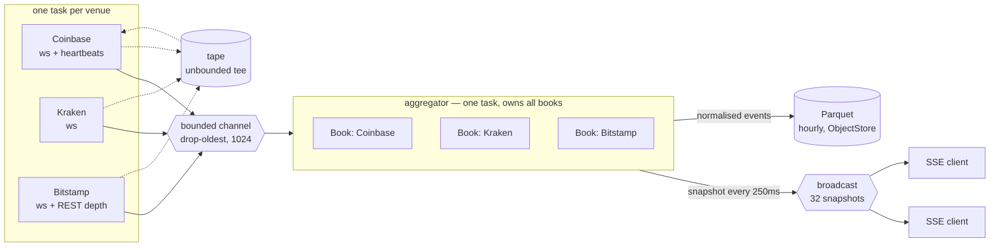
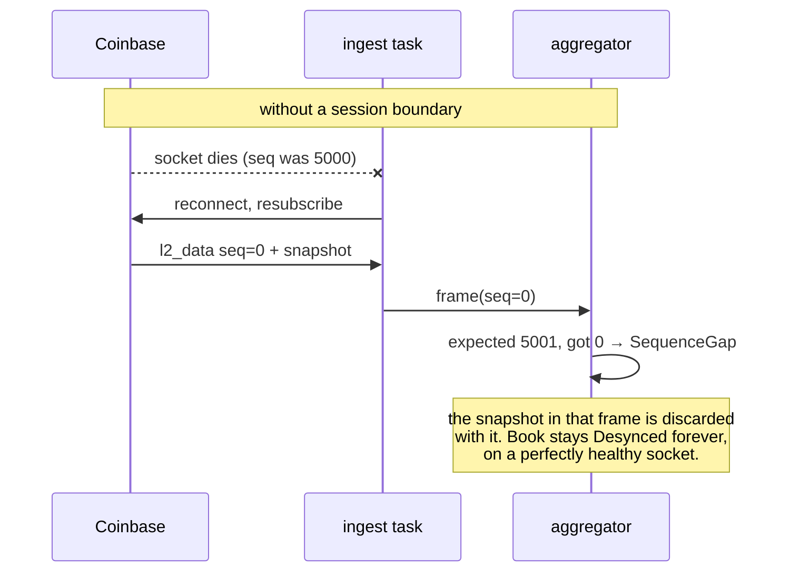
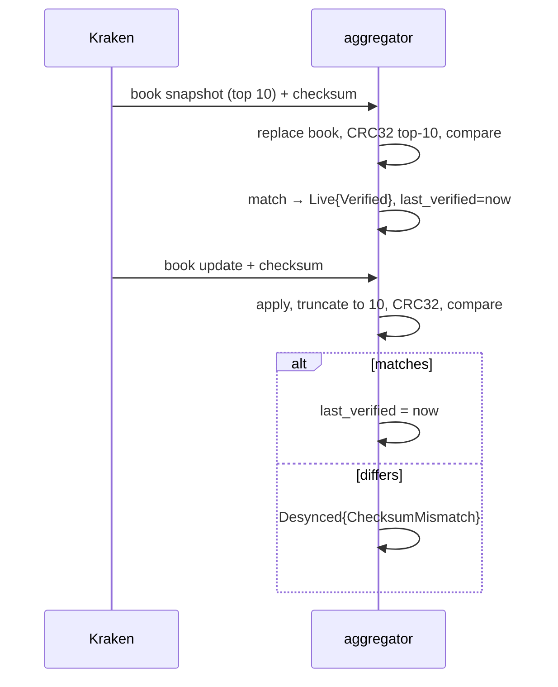
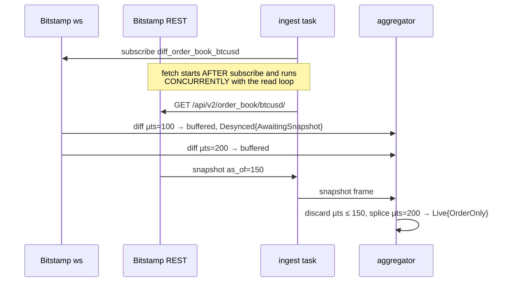
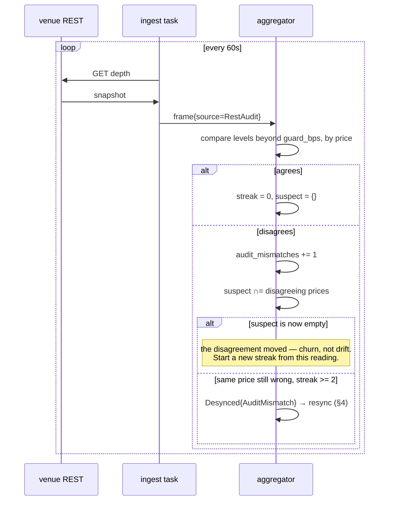
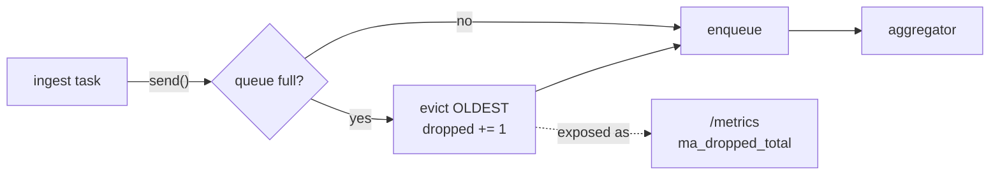
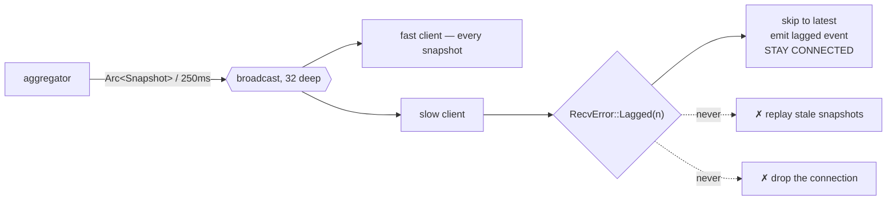
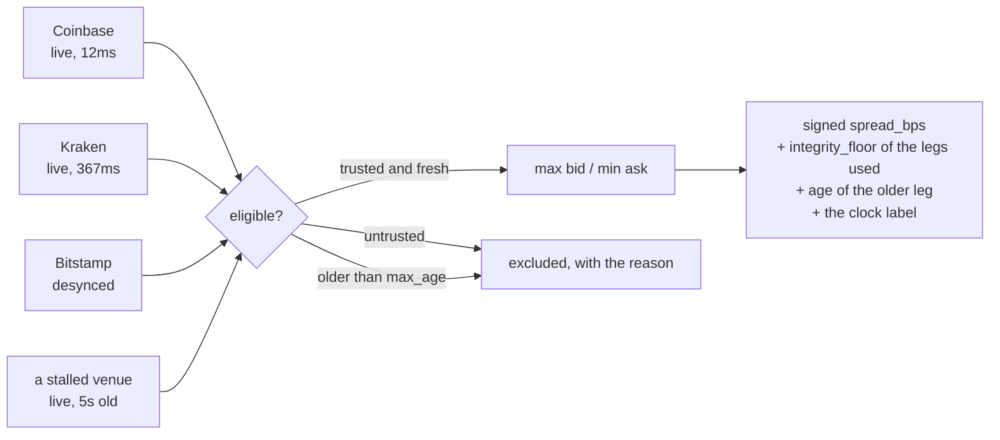
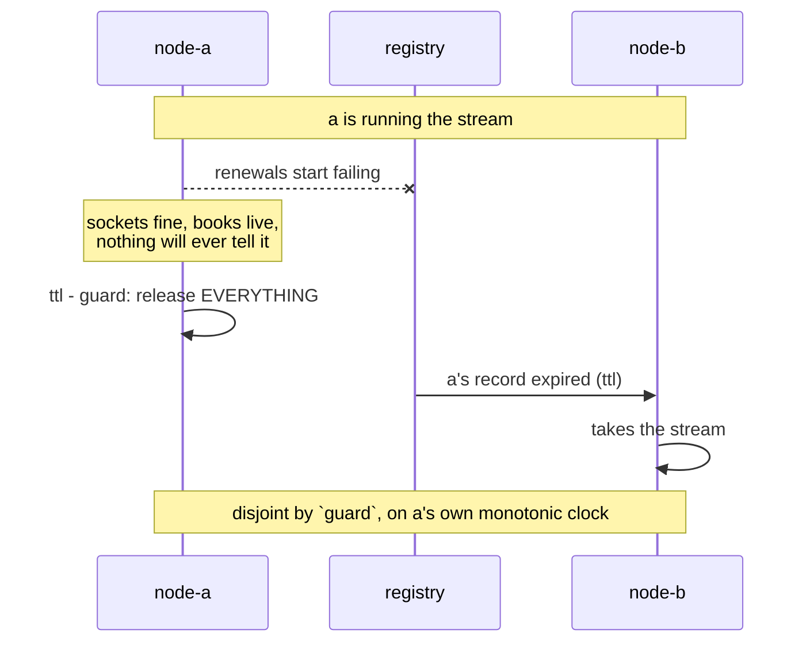

# market-aggregator — design and operation

Multi-venue crypto market data ingest, normalisation and fan-out, in Rust and
tokio. Three venues, any number of symbols, one process — with full L2 depth,
a periodic integrity audit, and a Parquet archive it can replay itself from.

This document is the reasoning, not the API docs — `cargo doc` has those, and
the module headers carry the local arguments. What follows is the part that is
unrecoverable three weeks later: why the pieces are shaped the way they are,
and what to do when one of them starts misbehaving at 3am.

---

## 1. What this is, and what it refuses to be

The interesting problem in a market data feed is not throughput. It is that
**an order book with a missed delta is silently wrong**, and silently wrong is
worse than obviously down. A process that crashes gets noticed. A process that
serves confident prices from a book that quietly lost a message at 02:14 does
not, and everything downstream prices against a market that does not exist.

So the whole system is organised around one question: *for every number we
publish, can we say how much it should be believed?*

Deliberately out of scope:

- **No Kafka.** At single-node scale it is operational burden without
  pedagogic payoff.
- **No equities.** Real-time equity data is paywalled; crypto is free and
  public.
- **No trading.** Read-only, and no API keys with trade permission exist.
- **No AI.** The point is the concurrency story.

---

## 2. The concurrency story



**Ingest tasks own a socket and nothing else.** No shared state, no books, no
knowledge that other venues exist. Each one connects, subscribes, reads,
reconnects, and pushes bytes into the channel.

**One task per *stream*, not per venue.** A stream is a `(venue, symbol)` pair —
`StreamId` — and it is the unit that owns a connection, a book, a set of
counters and a resync signal. All three venues would accept several symbols on
one socket, and this deliberately does not do that. §4's recovery path is the
reason: **a resync is a disconnect.** On a multiplexed connection, repairing one
symbol's sequence gap would tear down every other symbol's healthy subscription
with it, turning a single-book fault into a venue-wide outage. Per-stream
connections keep the blast radius of a resync to the book that needed one.

The cost is connections: venues rate-limit, and this multiplies sockets by the
symbol count. At a handful of symbols that is uninteresting. At fifty it would
be, and the honest answer there is v3's sharding rather than giving up the
isolation.

**The aggregator owns every book, exclusively.** One task, no locks. Not
because a `Mutex` would be slow at three venues — it would not — but because a
lock makes it *possible* to read one venue's book while another is mid-update,
and eventually someone does. Single ownership makes a torn cross-venue read
unrepresentable rather than merely unlikely, and the compiler enforces it: the
channel receiver is moved into the aggregator, so a second one cannot be
constructed.

**The crate boundary is the proof, not the documentation.** `ma-core` holds
the book and clock logic and has no `tokio`, no `reqwest`, no I/O of any kind
in its manifest. The claim "book logic is unit-testable without a network" is
therefore checked by the compiler, and `ma-core/tests/manifest.rs` fails the
build if an async dependency is ever added.

| Crate | Contains | May use |
|---|---|---|
| `ma-core` | `Book`, `MarketEvent`, `Price`, `IngestTime`, `StreamId`, the audit | nothing async |
| `ma-venues` | wire formats, per-venue sync, endpoints | `serde` only |
| `ma-pipeline` | channel, ingest, aggregator, tape | `tokio` |
| `ma-persist` | Arrow schema, Parquet writer, `ObjectStore`, S3 | `arrow`, `parquet` |
| `ma-server` | axum SSE, `/metrics`, the binaries | everything |

`ma-persist` exists as its own crate for the same reason `ma-core` has no
`tokio`: `arrow` and `parquet` are a large dependency that the pipeline should
not need in order to build or be tested, and the persistence layer should be
replaceable without touching the thing that produces the data.

---

## 3. Three venues, three guarantees

This is the heart of the design. The venues do not merely differ in spelling;
they differ in **what they can prove about your book**.

| Venue | Snapshot from | Ordering field | Detects loss? | Verifies state? | `Integrity` |
|---|---|---|---|---|---|
| Bitstamp | REST only | `microtimestamp` | **No** | No | `OrderOnly` |
| Coinbase | the websocket | `sequence_num` | Yes | No | `GapDetectable` |
| Kraken | the websocket | *(none)* | No | **Yes** — CRC32 | `Verified` |

Kraken has no sequence number at all and is nonetheless the *strongest* of the
three, because a checksum over the book you actually built validates the
**resulting state** rather than the path taken to it. A sequence number proves
you received every message; it says nothing about whether you applied them
correctly. Kraken's CRC32 would catch a delta applied to the wrong side. No
sequence number ever would.

Bitstamp is the weakest and is kept deliberately, because it is the only one
that exercises the REST-splice recovery archetype, and because a system that
only ever talks to well-behaved venues has not been tested.

### The type that carries this

`BookState` has three variants, and the third is the one that matters:

```rust
Uninitialized                                  // no data
Desynced { since, reason }                     // data I do not trust
Live { integrity, since, last_verified }       // data I trust, to a stated degree
```

The original brief asked only that consumers distinguish "no data" from "data
I don't trust". Bitstamp forces the third: a Bitstamp book reporting `Live` is
a materially weaker claim than a Kraken book reporting `Live`, and flattening
them into one boolean would be a lie the type system could have prevented.

`Integrity` derives `Ord`, weakest first, so any view spanning venues can take
the minimum and report the truth about the whole. The UI does exactly this,
in a banner above the cards, because a cross-venue spread that does not say
"order-only at best" is claiming more than the data supports.

---

## 4. Reconnect and gap-fill

**A reconnect is not a pause in the stream. It is a new stream.** Nothing
resumes: Coinbase restarts its sequence numbers, Kraken resends a snapshot,
Bitstamp sends nothing at all until a REST call lands. The book from before
the disconnect is not stale, it is *unknown*.

The ingest task therefore publishes a session boundary **through the same
channel as the frames** — so it lands in the right place relative to the
frames on either side even when the channel is backed up — and does so
*before* the backoff sleep, so the book is untrusted for the whole outage
rather than only once a new socket is up.

Omitting that message is not a small bug. Coinbase makes it concrete:



### Coinbase — resubscribe, gaps detected

```mermaid
sequenceDiagram
  participant V as Coinbase
  participant A as aggregator
  V->>A: l2_data seq=0, type=snapshot
  A->>A: replace book → Live{GapDetectable}
  V->>A: l2_data seq=1, type=update
  A->>A: apply delta
  V->>A: heartbeats seq=2
  A->>A: seq still contiguous — NOT a gap
  V->>A: l2_data seq=4
  A->>A: expected 3 → Desynced{SequenceGap}
  Note over A: recovery is a reconnect; there is no<br/>way to fetch message 3.
```

`sequence_num` counts every message on the **connection**, not on any one
channel. Counting only `l2_data` meant every heartbeat read as a hole — and
heartbeats are mandatory here, because Coinbase closes a sparse subscription
after 60–90 seconds. Live tape replay found this; no hand-written fixture did.

### Kraken — resubscribe, state verified



The book is truncated to exactly 10 levels because that is what we subscribed
to and what Kraken hashes. Pruning is safe **only** because the venue is
already sending a depth-limited feed; Coinbase and Bitstamp send full books
and are not pruned, since a delete inside a pruned window would expose a level
we threw away and could never recover from deltas.

### Bitstamp — REST splice, and what it cannot prove



Both halves of the ordering matter. Subscribing first means no diff generated
after the snapshot can be missed. Reading concurrently means the diffs that
arrive during the request are buffered rather than lost — fetching first and
reading second would produce a book quietly missing everything sent during the
call.

**The check the original brief assumed is impossible here.** That algorithm
calls for verifying the surviving buffer starts at exactly `snapshot_seq + 1`
and discarding everything if there is a hole. That needs a dense counter.
Bitstamp gives a microtimestamp, and time cannot detect a hole — an hour can
pass between two adjacent, entirely legitimate diffs. `as_of` discards what
the snapshot already covers; nothing can prove what survives is complete. That
gap is exactly what `Integrity::OrderOnly` names, and why the v2 plan calls
for a periodic re-snapshot audit rather than trusting the splice indefinitely.

Because the fetch is concurrent, a diff generated before the snapshot can be
*delivered* after it. Such a diff is redundant by definition, so the sync
tracks the splice point separately from the last applied timestamp and ignores
it — reporting it as a regression would desync a book that is exactly correct,
intermittently, under network timing, on the venue whose guarantee is already
the weakest.

### Closing the loop: detection is in one task, recovery is in another

The aggregator owns the books, so it is the only thing that can notice a
sequence gap or a failed checksum. The ingest task owns the socket, so it is
the only thing that can do anything about it. Every venue here recovers by
getting a fresh snapshot, and every venue only sends one on a new
subscription.

Until those two were connected, only half the system worked. A book desynced
by a **dead socket** recovered fine. A book desynced by **bad data** did not:
the connection stays healthy so the idle watchdog never fires, the venue keeps
sending updates the book correctly refuses to apply, and nothing ever asks for
the snapshot that would repair it. That is the wrong way round — a gap is
precisely the case the whole `Desynced` apparatus exists to catch.

```mermaid
sequenceDiagram
  participant V as venue
  participant I as ingest task
  participant A as aggregator
  V->>A: update, seq jumps 1 → 9
  A->>A: Desynced{SequenceGap}
  A->>I: resync requested
  Note over I: socket is perfectly healthy;<br/>drop it anyway
  I->>A: SessionEnded{ResyncRequested}
  A->>A: sync.reset(), book stays Desynced
  I->>V: reconnect + resubscribe
  V->>I: fresh snapshot
  I->>A: frame
  A->>A: Live again
```

Two things stop this from becoming a self-inflicted reconnect storm:

- Only the **transition into** `Desynced` requests a resync, not the state. A
  venue sending a hundred updates a second into a broken book produces one
  request, not a hundred.
- The `SessionEnded` path deliberately does **not** request one. It already
  means a reconnect is underway, and the `Desynced` state it produces is our
  own doing — treating it as a fresh problem would mean requesting a reconnect
  for every reconnect, against a venue that may already be rate-limiting us.

The request is a monotonically increasing counter on a `watch`, not a flag or
a queue: a request that arrives while the task is already mid-reconnect is not
lost, and several during one outage coalesce into one reconnect.

For Bitstamp a lighter recovery is possible in principle — re-fetch the REST
snapshot without dropping the websocket — and is deliberately not implemented.
A full reconnect gets a fresh socket *and* a fresh snapshot, which is the
stronger resync, and the lighter path is better designed alongside v2's
periodic re-snapshot audit than bolted on here.

### Backoff

Exponential, capped, with **equal jitter** — a random point in
`[ceiling/2, ceiling]` rather than AWS's better-known full jitter over
`[0, ceiling]`. Full jitter minimises contention when clients race for a
resource, but its best case is retrying immediately, and immediately is the
wrong thing to do to a venue that just rate-limited you. What gets an IP
banned is attempts per window, and full jitter puts no floor on that.

The schedule resets only after a session lasts `min_stable` (30s), not on any
successful connect. A venue that accepts the connection and closes it 500ms
later makes every attempt a "success"; reset-on-connect would pin the delay at
`base` forever and produce a reconnect storm built entirely out of successful
connections.

`next_delay()` returns a `Duration` rather than sleeping, which is what makes
the schedule assertable in microseconds instead of minutes.

### What a recorded reconnect proves, and what it does not

Until v4 this whole section had two kinds of evidence behind it and neither was
a recording. The scripted fake venue proves the *logic* against messages
someone wrote by hand. The two live tapes prove the *parsers* against real
bytes — but both are clean runs, with zero session boundaries between them. So
the path this section is about was the one path never exercised by real bytes,
which is exactly the position the parsers were in before the first tape existed,
and that went badly (§8).

`tapes/2026-08-09-btc-usd-reconnect.jsonl.gz` closes it: 105 seconds of three
live venues, with `record --reconnect-at 30,55,80` forcing one venue each to
drop and resubscribe. `crates/ma-server/tests/reconnect.rs` replays it offline.

Being exact about the claim, because the flag makes it easy to overstate:

| | |
|---|---|
| **Proven** | What each venue actually sends on resubscribe, in its own bytes — Coinbase's fresh `sequence_num` base, Kraken's new snapshot, Bitstamp's silence until the REST body lands — and that a book rebuilt from those bytes is right. Kraken's is right in the strong sense: its own CRC32 agrees with the rebuilt book, continuously, for the rest of the recording. |
| **Proven** | Blast radius. Three staggered boundaries produce exactly three desyncs, one per stream. A resync keyed by venue instead of by stream, or a multiplexed connection, would take neighbours down with it and show up as a fourth. |
| **Not proven** | *Detection.* The socket was closed by us, so nothing in the recording exercises the idle watchdog or a mid-stream socket error. Those stay proven against the fake venue, where a silent socket can be produced on demand and a live venue cannot be asked for one. |

The reconnect is requested through the same `ResyncRequests` handle the
aggregator uses when a book desyncs from bad data — not through a second
disconnect path added for recording. A boundary the production code could not
produce would be a fixture wearing a tape's clothes.

The tape earns its place immediately, in the way this project's tapes keep
doing: deleting the `book.reset()` in the aggregator's `SessionEnded` arm makes
the replay fail with `sequence gap: expected 521, got 0` — bug 1 of §8,
Coinbase's connection-scoped sequence counter, reproduced from real bytes for
the first time. Before this tape, that fix was only ever exercised against a
boundary the project synthesised for itself.

---

## 5. Auditing the venues that prove nothing

§3's table has a hole in it that v1 lived with and v2 closes. Kraken hashes the
book we actually built and sends the hash with every message. The other two
publish nothing that checks our book at all:

- **Bitstamp** is `OrderOnly`. A dropped diff leaves no trace anywhere in the
  protocol. The book is silently wrong from that moment and nothing will ever
  say so.
- **Coinbase** is `GapDetectable`, which catches a *lost message* and nothing
  else. A delta applied to the wrong side, or a level dropped by our own code,
  leaves `sequence_num` perfectly contiguous.

A periodic REST depth fetch is the only independent evidence either venue can
produce. Kraken is deliberately **not** audited: a comparison once a minute is
strictly weaker evidence than a checksum on every message, bought with extra
requests to a venue that rate-limits.

### Why the obvious implementation would be worse than nothing

A REST snapshot describes the venue's book at instant `T`. Ours, by the time
the response arrives, is at `T + δ` having applied every delta in between. On a
liquid pair δ is a hundred milliseconds and the touch moves several times
inside it. A direct comparison would disagree almost every time — and a check
that cries wolf continuously is worse than no check, because it trains its
reader to ignore the one occasion it is right. If it also desynced the book, it
would produce a permanent reconnect loop against a venue that bans for exactly
that.

Two properties rescue it, and they are the whole design:

**1. Drift near the touch self-repairs; drift far out does not.**
A lost delta leaves one price level wrong, and it stays wrong until something
rewrites that same price. Near the touch that is seconds; far out it can be
minutes. So the outer book is simultaneously where real corruption
*accumulates* and where the timing race *does not reach*.

**2. Genuine drift stays at one price; a race does not.** A timing discrepancy
is at a different level next time, because the book has moved on. A discrepancy
caused by a lost message is still there, at the *same* price, indefinitely.

### Both properties were wrong in their first implementation

Neither survived contact with live venues, and both failures are worth keeping
on the record because each looked obviously correct offline and each produced
the same symptom: every Coinbase and Bitstamp book desynced within two minutes
of startup, on a system whose books were in fact fine.

**The guard band was counted in levels.** On a dense book that is not a
distance at all:

| Coinbase BTC-USD | span |
|---|---|
| top 50 levels | 2.4 bps |
| top 1000 levels | 139 bps |
| 5 levels (the original guard) | 0.2 bps |

The touch moves further than 0.2 bps during the REST round trip, so the guard
sat entirely inside the churn it existed to exclude. It is now
`AuditPolicy::guard_bps`, a price distance, and the REST requests ask for
`limit=1000` so there is anything left to compare beyond it.

**"Two mismatching audits in a row" is not evidence.** Measured against the
live feed, disagreement by distance from the touch looks like this:

| Band | levels | disagree |
|---|---|---|
| 0–1 bps | 30 | 0% |
| 1–5 bps | 146 | ~2% |
| 5–10 bps | 150 | ~1.3% |
| 10–25 bps | 223 | **0%** |
| 25+ bps | 1451 | **0%** |

Beyond ten basis points the two books agree exactly. But an audit compares
hundreds of levels, so even a small residual rate means *something* disagrees
most of the time — at a **different price** each time. Requiring two mismatches
in a row therefore fired constantly.

The rule is now: **the same price must be wrong on consecutive audits.**
`AuditTrail` intersects the finding sets of successive audits; churn empties the
intersection and starts over, while a lost delta keeps its price in it. That is
what property 2 actually claims, stated precisely enough to act on.

`just audit-probe` prints the table above for any venue. It is how both of these
were diagnosed, and it is the tool to reach for before touching `AuditPolicy`.



The audit is **advisory first and authoritative second**. Every comparison
feeds `ma_audit_mismatches_total`, which is the honest primary output; only a
repeated finding is allowed to declare the book untrustworthy, and when it does
it routes into §4's existing recovery, because the repair for drift is the same
fresh snapshot every other desync needs.

Three details that are easy to get wrong:

- **Comparison is by price, not by index.** One extra level in either window
  would misalign an index-based comparison and report every subsequent level as
  wrong — turning one real discrepancy into hundreds of spurious ones and
  burying the price that mattered.
- **An inconclusive audit does not clear the streak.** If it did, a book could
  alternate mismatch/inconclusive forever and never accumulate evidence, while
  every individual reading looked defensible.
- **A desynced book is not audited at all.** It is *expected* to disagree —
  it is mid-recovery — and counting that would manufacture the evidence the
  audit exists to gather. Same argument as refusing to checksum a book that
  does not exist yet.

`FrameSource::RestAudit` is a separate variant from `RestSnapshot` because the
two do opposite things with identical bytes: one replaces the book, the other
compares against it. Collapsing them would mean every audit silently repaired
the drift it was meant to detect, and the book would look healthy forever. It
also means an audit lands on a tape and replays offline like everything else.

---

## 6. Backpressure



The channel is bounded and **drops the oldest event** rather than awaiting.
`send` is synchronous — there is no `.await` in its body, and a plain `#[test]`
with no runtime at all proves it, because the test would not compile if one
were ever added.

The justification is specific to market data: **a stale tick has negative
value.** A book update from three seconds ago is not a late-but-useful version
of the truth, it is actively misleading. Given a full buffer, the right event
to keep is the newest.

**This is the wrong answer for claims processing, or payments, or anything
where every message is a fact.** There, a full buffer means backpressure the
producer must respect, because losing message #4 to make room for #9 loses a
fact rather than a stale opinion. It is a defensible decision here only
because freshness makes it one, and only because the drop is counted.

Two places in this system deliberately take the *opposite* policy, and the
contrast is the clearest statement of the rule:

- **The tape tee is unbounded.** A tape is a record of what a venue actually
  sent. A tape with a hole silently invalidates every offline test built on
  it, so recording gets the claims-processing policy.
- **Replay waits for room** (`send_lossless`). Reading a file with no sleeps
  outruns any consumer. The first full-speed replay of a real tape dropped
  Kraken's opening snapshot, so every update after it applied to a book that
  did not exist, and the run reported hundreds of checksum failures that never
  happened live. `Pacing::Realtime` keeps drop-oldest, because there the
  producer genuinely is a live venue's pace.

### Fan-out and lagging clients



A lagged client is skipped forward, never disconnected, for the same reason
the ingest channel drops the oldest event: the snapshots it missed describe a
book that no longer exists. Replaying them walks a chart through stale prices
to arrive where it could have gone directly. Dropping the connection punishes
a reader for their network. The skip count is sent to the browser as a
`lagged` event rather than swallowed — a silent skip is the same class of
mistake as a silent drop.

---

## 7. Clocks

Every event carries both:

- `ingest_ts.mono()` — a monotonic `Instant`. **The only clock used for
  windowing, ordering, book age, or any comparison.** It cannot run backwards
  when NTP steps the system clock mid-session.
- `ingest_ts.wall()` — a `SystemTime`. **Output only**: logs, the UI, and
  eventually Parquet.

`IngestTime` deliberately does not implement `Serialize`, because serialising
an `Instant` is meaningless outside the process that created it. The
persistence layer must reach for a clock explicitly and answer the question
"which clock is this column?" in writing.

v2 pays that debt, and it turns out **one column is not enough**. The Parquet
schema carries three:

| Column | Clock | Used for |
|---|---|---|
| `ingest_wall_unix_nanos` | `SystemTime` at ingest | joins, humans. Can jump backwards under NTP, which is why it is not the ordering column |
| `ingest_elapsed_nanos` | monotonic, since the writer's first event | **ordering and replay pacing** |
| `venue_ts_unix_nanos` | the venue's own claim, nullable | skew measurement only |

`ingest_elapsed_nanos` is not an `Instant` — it is an *elapsed duration*, which
is meaningful in any process. That is exactly the answer the raw-frame tape
already gave with `elapsed_nanos`, and the two agreeing is deliberate: a second
answer to a solved question would have been the mistake.

**`venue_ts` was a v1 hole.** The field existed on `MarketEvent` and was never
populated, so clock skew was structurally unmeasurable and the Parquet column
would have been entirely null. v2 parses it — Coinbase and Kraken send RFC 3339,
Bitstamp's `microtimestamp` doubles as its clock. It is still never used to
order anything, which is what makes a hand-rolled RFC 3339 reader in `ma-venues`
an acceptable trade against pulling in a calendar library: the worst a bug there
can do is misreport skew.

Venue timestamps are retained but **never** used for ordering. They disagree
by seconds and some venues are simply wrong; they exist so skew can be
measured and reported, not trusted.

### Replay needs a clock of its own, and finding out why took v3

Replay reconstructs each frame's `IngestTime` as `base + recorded_offset`. At a
speed multiplier of `n` those offsets advance `n` times faster than the wall
clock, so an aggregator reading `SystemClock` compares *tape* time against
*wall* time and the two diverge without limit.

Every duration the aggregator derives is then wrong, and wrong in the direction
that hides it: `now` trails the events, `now.since(last_update)` saturates to
zero, and book age reads a healthy `0ms` while every rolling window — indexed
off the event clock — reads empty. `--speed 5` showed full books, zero ages and
no window data at all: three symptoms of one mismatch, none of which looks like
a clock problem.

`ScaledClock` closes it by construction, so a "10-second window" over a 5×
replay means ten seconds *of market*. At `speed == 1.0` it is `SystemClock`
with an offset, which is why a realtime replay was correct before it existed
and a fast one was not — and why this survived v1 and v2 undetected: nothing
before v3 published a number derived from a duration.

Full-speed replay (`Pacing::Faithful`) deliberately keeps the system clock. It
consumes a three-minute tape in about a second and has no wall-clock semantics
to preserve; its claim is about the *books*, not about time.

Every snapshot published to the UI carries a `clock: "ingest_monotonic"`
field. The rule that any surfaced comparison must name its clock is enforced
by shipping the label with the data, rather than documenting it here and
hoping.

---

## 8. Decisions, and what was rejected

| Decision | Rejected alternative | Why |
|---|---|---|
| `Decimal` behind a `Price` newtype | `f64` | Kraken's checksum hashes the venue's exact digits. `0.00100000` through `f64` re-serialises as `0.001`, which after the checksum's zero-stripping becomes `"1"` instead of `"100000"` — a totally different hash for a numerically identical value. Also: two wire-equal prices can compare unequal after an `f64` round trip and occupy two book levels. |
| Prices serialise as JSON **strings** | JSON numbers | JSON numbers are `f64` in every browser. A numeric price would undo the exact-decimal discipline at the last step, silently. A test pins it, because one feature flag on `rust_decimal` would flip it. |
| Bitstamp as third venue | Binance | Binance returns HTTP 451 from US IPs. |
| Bitstamp as third venue | Gemini | Gemini sends its snapshot over the websocket like Coinbase, which would leave two venues in one archetype and the REST-splice path untested. |
| Drop-oldest ingest channel | Block the producer | See §5. Ingest must never block on a slow consumer. |
| `Mutex<VecDeque>` in the channel | Lock-free queue | The critical section is O(1) and never held across an `.await`. At three venues, contention is not a real cost; a reader seeing the whole invariant in one short block is. |
| Single-owner aggregator | `Arc<RwLock<Books>>` | Makes a torn cross-venue read impossible rather than unlikely. |
| Equal jitter | Full jitter | See §4. Full jitter's best case is an immediate retry against a venue that just rate-limited you. |
| Raw-frame tape | Recording normalised events | Recording after parsing means a session can never reproduce a parser bug or a venue schema change — the two failures most likely to happen unattended. All three bugs found so far were of exactly that kind. |
| SplitMix64 for jitter | the `rand` crate | Jitter has no cryptographic requirement, and an explicit seed makes a failing schedule reproducible by pasting it back. |
| No Kafka | Kafka | Ops burden without payoff at single-node scale. Revisit at v3 sharding. |
| One connection per `(venue, symbol)` | one connection per venue, multiplexed | A resync *is* a disconnect. Multiplexing would tear down every other symbol's healthy subscription to repair one book. See §2. |
| Depth served ≠ depth retained | pruning every venue to the served depth | Pruning is only safe where the venue publishes a depth-limited feed (Kraken). On a full-depth feed a delete inside the retained window exposes a level that can never be recovered from deltas. |
| Audit requires the **same price** wrong twice running | any two consecutive mismatches | Measured: ~2% of levels in the 1–10 bps band disagree at any instant, so *some* level is nearly always wrong. Only a price that stays wrong is drift. See §5. |
| Audit guard measured in **basis points** | a level count | On a dense book a level count is not a distance: 50 levels of Coinbase BTC-USD span 2.4 bps. The level-counted guard sat inside the churn it existed to exclude. |
| Parquet prices as **strings** | Arrow `Decimal128`, or floats | `Decimal128` fixes one scale per column and these venues do not share one. Kraken's checksum covers the digits it sent, trailing zeros included; a column-wide scale would silently rewrite them. |
| Parquet: one row per **level** | one row per event, levels nested in a `list<struct>` | A file nobody can query is just an expensive tape, and the tape is better at being a tape. Flat rows make "what was on the book at 03:14" a predicate rather than an unnest. |
| Parquet teed from the **aggregator** | a second consumer of the raw-frame channel | A second consumer would have to duplicate every `VenueSync` and would eventually disagree with the first. Teeing after normalisation means the archive is the same event sequence the live books were built from. |
| Partition `symbol=` **above** `date=` | date first, symbol below it | The symbol set is small and near-static; the date set grows forever. Symbol first prunes a single-symbol query to one subtree, date first makes it walk every hour in the range and prune inside each. |
| Symbol kept as a **column** as well as a partition | drop the column, recover it from the path | The path is a physical layout a reader may or may not understand: Hive-aware engines recover it, a plain `ParquetRecordBatchReader` opening one file does not. Dropping it makes a file's contents unidentifiable outside its directory. |
| Archive reader **merges partitions** on wall clock | `event_seq`, or `elapsed` | Both restart at zero in every writer run, and an archive holds one run per process restart. Merging two runs by `event_seq` interleaves run B's tenth event with run A's tenth. |
| A `ScaledClock` for `--speed` replay | the system clock, as v1 and v2 used | At `n×`, tape timestamps advance `n×` faster than wall time. The aggregator then reads zero book ages and empty windows — symptoms that look like a data problem, not a clock one. |
| Window coverage as `trusted_ms` + `span_ms` | a single `coverage` fraction | Two integers say *which* of the two is unusual — a young process and a flapping book both read 0.5. A fraction also invites `f64` into a crate that lints against it. |
| `range_bps` as the volatility figure | realised volatility (stdev of log returns) | Needs a log and a square root, so `f64`, so the exact-decimal discipline breaks at the last step. The range is cruder, exact, and assumes no distribution. |
| One bucket ring per stream, shared by every span | one sample buffer per configured span | Memory becomes `O(longest / resolution)` instead of `O(updates_per_sec × longest)` — kilobytes rather than megabytes per stream on Coinbase — and a fourth window costs nothing at ingest. |
| Window readings exclude the in-progress bucket | include it, partially filled | Makes `span_ms` exactly a whole number of buckets rather than "about `S`, plus however far into the current one we are". Costs one tick of lag; buys an assertable boundary. |
| Cross-venue staleness measured on **book age** | time since the touch last moved | Measured: the v1 tape carries 49,940 Coinbase level updates with the touch unchanged throughout. On a gap-free incremental feed a touch that has not moved *has not changed* — the venue would have sent a delta. Touch age would read a healthy feed as a minute stale. |
| A cross-venue cross is not a desync | route it into `DesyncReason` like a crossed book | Within one venue, bid ≥ ask is proof of misapplication. Across venues it is an ordinary market state; wiring them together would reconnect every stream whenever two exchanges disagreed by a basis point. |
| Rendezvous hashing for assignment | `hash(stream) % nodes.len()` | Modulo reshuffles ~two thirds of assignments when a third node joins, against the third that must move. Every reassignment here is a disconnect and a resync against a venue that bans for reconnect storms. |
| A hand-written FNV+SplitMix hash | `DefaultHasher` | SipHash keys are not specified to be stable across a rebuild, a Rust version, or a process. Two nodes would compute *different* assignments from the *same* membership and both claim a stream — the exact failure the lease design prevents, reintroduced above it. |
| Lease expiry enforced by the **holder** | readers decide who is alive | Safe only if the dead node agrees it is dead. A node partitioned from the registry has healthy sockets, live books, and no way to be told. |
| A settling period on join | acquire as soon as the assignment says so | Covers the mirror case: a joining node seeing `{A,B}` before A has seen B. See §13. |
| Lease registry with no compare-and-swap | conditional writes, or `etcd` | Each node writes only its own key, so there is nothing to serialise. That is what makes a plain directory a complete implementation — and what would make an object store one. |
| No Kafka, and now no etcd | a consensus system for membership | Revisited at v3 as CLAUDE.md asked. The problem is membership, not a log, and membership by lease needs a clock and one writable key per node. |
| S3 behind a default-off feature | always compiled | Makes CLAUDE.md's "nothing touches AWS before v2" structural rather than remembered: the offline suite cannot acquire a dependency on credentials. |

### What the live tape found that fixtures did not

Worth recording, because it is the argument for the tape recorder existing:

1. **Coinbase `sequence_num` is connection-scoped**, not per-channel. Every
   heartbeat read as a gap.
2. **Coinbase says `offer`, not `ask`.** The docs and the hand-written
   fixtures said `ask`. Getting this wrong drops every ask update, leaves a
   one-sided book, and a one-sided book can never cross — so the crossed-book
   detector, the last-resort check, never fires either.
3. **Kraken's `status` frame has no `symbol`**, and the envelope was typed
   eagerly, so every connection produced a parse error on the counter whose
   entire job is signalling schema drift.

All three fixture suites were green throughout. A fixture author writes the
messages they are thinking about.

### What the *second* tape found, while v3 was being built

Two more, and both are the same lesson at a different layer — a thing that is
only observable over a long enough run against real traffic.

4. **A matching checksum was being read as a state transition.** Transitions
   are detected by comparing whole `BookState` values, and `Live` carries
   `last_verified`, which `mark_verified` advances every time Kraken's CRC32
   matches. Kraken produced 1006 "book is live" INFO lines for 1108 messages,
   and `status_since` reset on every one — so a Kraken book healthy for two
   minutes reported having been live for however long since its last message.
   Coinbase and Bitstamp publish no checksum, so neither showed it. It needs a
   *stream* of matching checksums against a book that stays live, which no
   fixture produces. `BookState::same_status` is the comparison that was
   actually wanted; `PartialEq` stays exact.

5. **Realtime replay drifted one timer tick per frame.** Pacing slept for the
   *gap* between consecutive frames, and a sleep may only overshoot, so every
   frame added a debt never repaid. On a 5827-frame tape that reached ~7
   seconds by the halfway point, and because replayed frames carry
   reconstructed `IngestTime` while the aggregator reads a real clock, **every
   book reported a seven-second age while frames arrived normally**. The page
   greyed every card, and §12's staleness guard excluded every venue. Now
   scheduled against a fixed origin, so a late frame catches up instead of
   pushing everything after it further back.

The second is the more uncomfortable of the two: the bug was in the *test
harness* — the thing every offline claim in this document rests on — and it
presented as a bug in the system under test.

---

## 9. Operating it

```bash
just test                       # full offline suite; passes in airplane mode
just serve                      # connect to all three venues, http://127.0.0.1:8080
just serve coinbase,kraken,bitstamp BTC-USD,ETH-USD   # several symbols
just archive /var/lib/market-data                     # serve, and keep the history
just demo tapes/<tape>.jsonl.gz # replay a recording at its original pace, with the page
just replay-archive /var/lib/market-data              # replay the Parquet archive
just record coinbase,kraken,bitstamp BTC-USD 60       # capture a new tape (needs network)
just cluster                    # two nodes sharding the streams, :8081 and :8082
just cluster-status             # who owns what, across a running cluster
```

Endpoints: `/` the page, `/events` SSE, `/metrics` Prometheus text,
`/api/snapshot` one JSON reading, `/cluster` this node's view of the cluster
(404 when not clustered — "not configured" and "cannot see the cluster" are
different situations), `/health`.

### What each metric means, and what to do when it moves

| Signal | Means | Do |
|---|---|---|
| `ma_book_live{venue} = 0` **and** status `uninitialized` | No data at all. Never synced, or the snapshot never arrived. | Check `connects_total`. If zero, the venue is unreachable. If non-zero, the subscribe payload and the parser have probably drifted — the page's channel name is the thing to check. |
| status `desynced`, reason `sequence gap` | A message was genuinely lost. | Coinbase recovers only by reconnecting. If it persists, the connection is lossy; check for a proxy. |
| status `desynced`, reason `checksum mismatch` | **Our book differs from Kraken's.** The most serious signal here — it means misapplication, not just loss. | Reconnect for a fresh snapshot. If it recurs, treat the book application logic as suspect and reproduce it from a tape. |
| status `desynced`, reason `awaiting a REST depth snapshot` | Normal for Bitstamp at startup, for a second or two. | Only act if it persists — then check `rest_failures_total`. |
| status `desynced`, reason `crossed book` | Best bid ≥ best ask, which is impossible within one venue. Proof of misapplication. | Same as a checksum mismatch. This is the only loss signal Bitstamp has. |
| `ma_desynced_total_ms` climbing steadily | The book flaps in and out of sync. Instantaneous availability looks fine and the feed is useless. | This is the number to alert on, not `book_live`. |
| `ma_dropped_total` climbing | The aggregator cannot keep up with ingest, and the channel is discarding stale ticks. | Working as designed, but it means the published book lags reality. Check CPU before raising `CHANNEL_CAPACITY` — a bigger buffer hides the problem rather than fixing it. |
| `ma_idle_timeouts_total` climbing, `connect_failures_total` flat | The venue accepts connections and then goes silent. | Nothing below the application layer will report this. Usually a venue-side problem; the watchdog is already reconnecting. |
| `connect_failures_total` climbing fast | Often a rate limit. | **Do not restart in a loop.** The backoff is already capped at 60s. Restarting the process resets the schedule and is how a temporary block becomes a lasting one. |
| `ma_parse_errors_total` non-zero | The venue changed its wire format, or we misread it. | Record a tape and replay it. This is what the tape recorder is for. |
| `ma_audit_mismatches_total` climbing, book still `live` | **The most interesting reading v2 adds.** The book disagrees with the venue's REST depth repeatedly, but never twice in a row — so no single comparison could prove it. | Real. A book that races cleanly would disagree at random, not persistently. Pull the archive for that hour and diff the deep levels; suspect a delta being applied to the wrong side. |
| status `desynced`, reason `depth audit disagreed` | Two consecutive audits found the same book wrong. On Bitstamp this is the *only* loss signal that exists. | The resync has already been requested. If it recurs after a fresh snapshot, the fault is in our application logic, not the venue's stream. |
| `ma_audit_failures_total` climbing, `ma_audits_total` flat | The audit endpoint is unreachable. The book is **unchecked**, not wrong. | Nothing is broken yet, but the venue's weakest guarantee is now the only one in force. Check the REST host before assuming the feed is fine. |
| `ma_book_levels` far larger than the served depth | Normal, and worth understanding. Coinbase holds five figures of depth while serving ten levels. | Nothing. A *small* number here on Coinbase or Bitstamp would be the surprise — it would mean the book is being pruned, which is unsafe on a full-depth feed. |
| `ma_window_trusted_ms` well below `ma_window_span_ms` | Every other window series for that stream covers less time than its label says. | Not a fault on its own — it is the *correct* reading during and after a desync. It becomes one if it persists on a book whose `status` has been `live` throughout, which would mean the coverage accounting and the book disagree. |
| A window gauge missing entirely for a stream | No trusted two-sided sample landed in it. | Expected at startup and during a resync. The series is absent rather than `0` on purpose: Prometheus cannot express "unknown" inside a sample, and a zero range would draw as a flat line where the honest rendering is a gap. |
| `ma_cross_spread_bps` negative | The venues' books are crossed: highest bid above lowest ask. **Apparent** arbitrage. | Read `ma_cross_oldest_leg_ms` beside it — the two quotes were never simultaneous — and remember it is gross of taker fees on both legs, of latency, and of transfer time. A persistent large one is far more likely to be a bug in one venue's book than free money. |
| `ma_cross_venues_used` below the venue count | Some venue is untrusted or stalled and is excluded from the consolidated touch. | `/api/snapshot` names each exclusion and its reason. A view that has quietly narrowed to one venue looks exactly like one drawn from three, which is why this is published beside every cross-venue number. |
| `ma_cluster_owned_streams` summed over nodes **exceeds** the configured stream count | Two nodes are running one stream. **The one thing the coordination layer exists to prevent.** | Serious: duplicate subscriptions against venues that ban for it, and doubled metrics under identical labels. Check that every node was started with the same `--symbols`/`--venues` — the assignment is a pure function of that list and nothing can verify it from inside one process — and that no two nodes share a `--node-id`. |
| ...summed over nodes **below** the configured count | Some stream is running nowhere. | The deliberately-preferred failure: loud, and visible as `uninitialized`. Normal for `ttl + guard` after a node joins or dies. If it persists, look at `ma_cluster_stood_down`. |
| `ma_cluster_stood_down` is 1 | This node released everything because it could not complete a registry round trip within `ttl - guard`. | **Alert on this, not on `owned_streams` being zero** — a node given no work and a node that went blind look identical by stream count. Its sockets were fine; the registry was not. Check the cluster directory's permissions and mount. |
| `ma_cluster_last_contact_ms` climbing | Registry round trips are failing. At `ttl - guard` the node stands down. | The early warning for the row above. |
| `ma_cluster_members` disagreeing between nodes | Normal for one renewal interval after a change; a lasting disagreement means one node cannot read what another can write. | The lease argument tolerates this — it is exactly what holder-side expiry and the settling period cover — but a *persistent* split means the registry is not the shared thing it is assumed to be. |
| `ma_book_age_ms` large, status still `live` | Nothing has invalidated the book, but nothing is updating it either. | On a live feed the idle watchdog should have fired; if it has not, check that the heartbeat subscription is actually established. |

### A note on restarts

There is no persistent *book* state. Restarting loses every book and every
counter, and each stream resyncs from scratch — a few seconds for Coinbase and
Kraken, a REST round trip for Bitstamp. That is cheap, but it also means
restarting erases the evidence. Take a `/api/snapshot` and a `/metrics` scrape
first.

The **archive** is a different matter, and v2 had a real gap here that only
showed up by killing a live run. A Parquet file is unreadable until its footer
is written, so an open file is worth nothing to anyone but the writing process.
Two things bound the loss:

- The process handles `SIGTERM` as well as Ctrl-C, and the shutdown path waits
  for the writer to finish and store its open file. Before that, a `pkill`
  discarded everything since the last roll — which on hourly rolls could be
  fifty-nine minutes. An orchestrator sends `SIGTERM` on every deploy, so this
  was the common case, not the exceptional one.
- `WriterConfig::max_open` (5 minutes) closes a part regardless. The hour
  decides the *partition*; this decides how much is ever at risk. Several
  `part-NNNNN.parquet` files inside one `hour=HH/` directory read as one hour
  to any query engine.

Since v4 both of those are **per symbol**, because the partition is
`symbol=X/date=D/hour=H/` and each symbol holds its own open file. One symbol
crossing an hour must not close another's file, whose hour has not ended and
whose `max_open` deadline is nowhere near; a global roll would make every
partition's part boundaries a function of whichever symbol ticked first. The
cost is that a run over *n* symbols holds *n* row-group buffers and produces
*n* times the files.

A hard kill (`SIGKILL`, OOM, power) still loses up to `max_open` of history.
That is the deliberate floor, not an oversight: the alternative is fsyncing per
event, which would put the durability layer on the ingest hot path — the exact
coupling the bounded channel exists to prevent.

---

## 10. What v2 left unproven

v1 and v2 are complete: three venues, any number of symbols, full L2 depth,
reconnect with gap-fill, a periodic integrity audit, the three book states, SSE
and a page, metrics, a Parquet archive the process can replay itself from, and
a committed tape the whole thing replays from with no network.

What v2 added, and what each piece is actually worth:

| | Status |
|---|---|
| Multi-symbol, one connection per stream | Done, run live against two symbols across three venues |
| Full L2 depth, served ≠ retained | Done |
| Periodic REST depth audit | Done, and **corrected twice against live venues** — see §5 |
| Parquet, hourly rolls, `ObjectStore` | Done, with an end-to-end round-trip test through the real pipeline |
| Parquet replay | Done, and still checksum-verified against Kraken |
| S3 | **Run against a real bucket**, once the IAM gate was satisfied. See below |

### The gate, and what finally opened it

`ma-persist`'s S3 store spent v2 written, compiled and never pointed at a
bucket. That was the sequencing rule in CLAUDE.md: nothing writes to S3 before
an IAM user scoped to one bucket prefix replaces any root credentials. The rule
was satisfied during v3, and the store has now been exercised end to end.

Four things make the rule structural rather than remembered:

1. **The feature is off by default**, so the offline suite cannot acquire a
   dependency on credentials.
2. **A prefix is mandatory.** A writer that can address a bucket root is not
   "scoped" whatever the policy says.
3. **`MA_S3_ACK_SCOPED_IAM=1` is required to start** — somebody decided to
   reach AWS, rather than defaulting into it.
4. **The scoping is verified.** `S3Store::connect` asks S3 to list the bucket
   *outside* the configured prefix and refuses to start if that succeeds.

Point 4 replaced a weaker claim this document used to make, and the correction
is worth keeping. The old text said nothing in the process could tell a scoped
key from a root one — true of the *credentials*, and false of the *question*.
The rule does not care who the principal is; it cares whether this process can
reach outside its prefix, and that is answerable by asking. Root gets `200` at
the bucket root; a prefix-scoped user gets `AccessDenied`.

It answers the better question too: a root key confined by a bucket policy
passes, because it *is* confined, and a scoped user whose policy is wider than
intended fails — which an ARN check would have waved through.

The classifier has three outcomes and the third is the one that matters:
*denied* is the only success, *allowed* is a refusal, and **anything else —
DNS, no credentials, a typo'd bucket — is a refusal too**, never read as
"denied, therefore scoped". That third arm earned itself immediately: the first
live run hit a credential-provider configuration error, and reading it as a
denial would have started the process with unusable credentials and a clean
bill of health.

### What the first live run established

Run against `s3://…/events` as the scoped user, then read back:

| | Result |
|---|---|
| Scope probe against real IAM | Refused ambient root; passed the scoped profile |
| Hourly partitioning | `events/live/date=2026-08-09/hour=08/part-00000.parquet` — the v2 layout; v4 puts `symbol=BTC-USD/` above the date, and `EventReader` still reads both |
| `SIGTERM` flush (the v2 fix) | 58,574 rows, one file, no loss |
| Replay **out of S3** | 1578 events, 0 dropped; all three books rebuilt to `Live` at their correct per-venue `Integrity` |

What that leaves untested is the far tail: pagination past the first page of a
listing, and multi-part behaviour at file sizes this project does not yet
produce.

---

## 11. Rolling windows, and the coverage every one of them carries

v1 and v2 published *instantaneous* readings. A window answers the second
question anyone asks — how much has it moved — and it does so by making a claim
about a stretch of time.

**That claim is usually false, and predictably so.** A "60-second high" over a
book that spent twenty of those seconds `Desynced` is a 40-second high wearing a
60-second label. It is not an edge case: every reconnect and every sequence gap
puts a hole in a window, and a Bitstamp book is `Desynced` for its first REST
round trip by construction.

So every reading carries `trusted_ms` beside `span_ms`, and the weakest
`Integrity` it sampled under. It is `weakest_integrity`'s argument one dimension
over: a window spanning a reconnect can hold samples taken under two different
guarantees, and reporting the stronger is the lie `Ord` on `Integrity` exists to
prevent. A window with nothing in it is `None` everywhere rather than zero.

Coverage is accounted by **interval**, not by sample. A book silently desynced
for 900ms between two updates has 900ms of untrusted time whether or not
anything was sampled during it; a counter incremented per observation would
report a silent desynced book as perfectly covered.

```
resolution ──►  │ b0 │ b1 │ b2 │ b3 │ b4 │ b5 │ b6 │ b7 │ b8 │
                └────┴────┴────┴────┴────┴────┴────┴────┴────┘
 1s window                          ╰──────── 4 ────────╯  ▲
10s window      ╰──────────── 8 (and more) ────────────╯   │
                                                  in progress,
                                                    excluded
```

One bucket ring per stream, sized to the longest span; a window of span `S` is
its last `ceil(S/resolution)` **completed** buckets. Adding a span costs nothing
at ingest and nothing in memory. Excluding the in-progress bucket is what makes
`span_ms` exactly a whole number of buckets rather than "about `S`, plus however
far into the current one we are" — one tick of lag, bought for an assertable
boundary.

Sampling happens per applied message, not per publish tick: a tick-sampled high
on a book updating hundreds of times a second misses most of what it claims to
measure.

---

## 12. The consolidated touch, and the arbitrage it appears to show

Highest bid and lowest ask across venues. Usually an ordinary spread, tighter
than any single venue's. Occasionally the bid is *above* the ask and the books
are crossed.

This is the most misreadable number the system publishes, and it is §5's problem
one layer up: there, a REST snapshot from instant `T` was compared against a
websocket book at `T + δ`; here, two different venues' books are compared, and
they were never observed at the same instant either.



Three rules make it evidence rather than noise:

1. **Only trusted books participate.** A `Desynced` book retains its last
   contents deliberately, and those contents are exactly what an unguarded `max`
   picks up — a frozen aggressive bid showing a standing arbitrage against every
   healthy venue beside it.
2. **A stalled book does not participate.** Not because a quiet book is wrong,
   but because a stalled one is: its touch is a quote from a market that has
   since moved. `max_age` (2s) sits far beyond a healthy inter-update gap and
   inside the tightest idle watchdog — the window where a socket has gone quiet
   but nothing has reconnected it yet.
3. **The integrity floor is taken over the legs used, not the venues present.**
   A spread whose ask came from Bitstamp is an order-only number whatever the
   bid's venue proves; and a desynced third venue must not drag down a figure it
   contributed nothing to.

The tempting refinement — measuring staleness as *time since the touch last
moved* — is wrong, and the v1 tape is the counter-example: 49,940 Coinbase level
updates with the touch unchanged throughout. On a gap-free incremental feed a
touch that has not moved has not *changed*.

And a cross here never desyncs anything. Within one venue, bid ≥ ask is proof of
misapplication; across venues it is an ordinary market state.

---

## 13. Sharding, and a safety argument instead of a consensus system

One process holding every stream is right at a handful of symbols. At fifty,
three venues is 150 sockets on one node — and §2 has always named sharding as
the honest answer rather than multiplexing away the isolation §4's recovery path
depends on.

**The property:** at most one node runs a given stream. Its dual — every stream
running somewhere — is weaker in consequence, and the asymmetry is the design.
An unowned stream is loudly `uninitialized`; a doubly-owned one looks fine from
every angle until the venue starts refusing connections. **Prefer the visible
gap to the silent duplicate** — the same judgement `Desynced` makes about a
book.

Two pieces. *Which node owns which stream* is a pure function of the live
membership (rendezvous hashing), so every node computes the same answer without
talking to any other — that is what removes the need for a leader. *Who is a
member* is a lease, and each node writes exactly one key: its own. No node ever
writes a key another node writes, so there is nothing to serialise and no
compare-and-swap anywhere, which is why a plain directory is a complete
registry.

What replaces agreement is a lease argument with two halves.

**Half one: expiry is enforced by the holder.** Letting readers decide who is
alive is safe only if the dead node agrees it is dead — and a node partitioned
from the registry knows nothing has happened. Its sockets are fine, its books
are live, and it keeps publishing. So a node releases *everything* if a complete
round trip has not succeeded within `ttl - guard`, while no reader can observe
expiry before `ttl`.



**Half two: a joining node waits.** The mirror case is the one that looks safe:
B starts, sees `{A, B}`, and takes a stream A is still running because A's reads
happen to be failing. So a node acquires nothing until `ttl + guard` after its
own first successful announcement. The argument: B's record is durable from
`t_write`, so any successful membership read after `t_write` returns B; if A
never releases by recomputing, A had no successful round trip after `t_write`,
so A's own deadline is `t_ok + ttl - guard` for some `t_ok < t_write`, and A
therefore releases strictly before B can acquire. Disjoint by `2 × guard`.

The argument depends on the hold deadline being extended only by a **complete**
round trip — announce *and* read. A node that can write but not listen would
otherwise keep renewing its right to hold streams it can no longer be told to
release.

Both halves are load-bearing, and the offline suite proves it the only way that
means anything: reverting either one makes the disjointness assertion in
`ma-coord/tests/cluster.rs` fire, naming the overlapping streams. Those tests
step several coordinators through one in-process registry against a `TestClock`
and check after *every* pass, because a violation lasting 250ms in production is
a venue ban and a fortnight of wondering why.

The clock split is §7's, one layer up: the record carries a **wall** timestamp
because other machines have to compare it, and the holder's own deadline is
**monotonic** so an NTP step cannot extend its lease.

Two things nothing in the process can check, so they are stated instead. Every
node must be started with the same `--symbols` and `--venues`, because the
assignment is a pure function of that list. And two processes must never share
a `--node-id`, because they would share a lease and each would renew the
other's.

**CLAUDE.md said to revisit Kafka at v3 sharding. Revisited, and declined.** The
coordination problem here is membership, not a log, and membership by lease
needs a clock and one writable key per node.

### The registry in an object store, and what it cost

v3 said the absence of a compare-and-swap in `Registry` "is the design, not an
omission", and that the shape would port to an object store unchanged. v4
cashed that, and the bill was three calls:

| Registry operation | S3 |
|---|---|
| `announce` | `PutObject` — atomic per object, so no staging-and-rename as `DirRegistry` needs |
| `members` | `ListObjectsV2` then one `GetObject` per record |
| `withdraw` | `DeleteObject` |

No conditional write, no `If-None-Match`, no DynamoDB table beside the bucket
to hold a lock. That is cheap because of the lease argument above and not
because of anything S3 offers: **no node ever writes a key another node
writes**, so there is nothing to serialise. Had membership been one shared
document, this would need a compare-and-swap and would still be leaning on the
wrong primitive.

One assumption is worth naming rather than inheriting from the filesystem. The
settling argument turns on *B's record being durable from `t_write`, so any
successful read after `t_write` returns B* — read-after-write and
list-after-write consistency. S3 has provided both strongly since December
2020. Under the older eventual-consistency model this file would have been
**unsound rather than slow**: a joining node could be invisible to a listing
taken after it announced, and the disjointness proof would quietly not hold.

**What the first live run established (2026-08-09).** Two processes, six live
streams, `s3://…/events/cluster`:

| | Result |
|---|---|
| Scope probe | Bucket-root listing denied for the scoped user; startup proceeded |
| Settling | Neither node held anything for 17s (`ttl + guard`), then both acquired |
| Assignment | 4 / 2 split, and each node's `elsewhere` was **exactly** the other's `owned` — disjoint and complete |
| `kill -9` on node-a | node-b took all six streams 16s later: `ttl` plus one renewal, as a hard kill must cost |
| `SIGTERM` on node-b | Clean stop — and the withdrawal was **refused** |

That last row is the finding. This project's own IAM user is scoped to
`PutObject`, `GetObject` and `ListBucket` and **not** `DeleteObject`, so
`withdraw` fails and the record stays behind. Nothing breaks, and that is by
construction rather than by luck: a node that cannot delete its own record is
indistinguishable from one that was `kill -9`'d, and the lease argument already
has to cover that case, because no shutdown path runs on a hard kill. The
safety property is untouched; the only thing lost is the *speed* of a clean
handover.

It is deliberately not treated as an error, because every available reaction is
worse than waiting — retrying hammers a registry that has already said no, and
treating it as fatal turns a permissions gap into a crash loop.
`ma-coord/tests/cluster.rs` now pins this offline with a registry whose
`withdraw` always fails, asserting both halves: B does **not** grab early while
the stale record is inside its `ttl`, and does take over once it expires.

Stale records do not accumulate, because a record is named after its node: a
restarting `node-a` overwrites `node-a.json` rather than adding to it. The
residue is one dead object per node id that never returns, and one extra
`GetObject` per renewal for each.

Two operational notes. A registry belongs in its own prefix, not inside the
archive's; the live run used `events/cluster` only because the scoped user
cannot reach anything outside `events/*`. And `ttl` must account for a registry
round trip now being a network call — a value tuned for a shared directory will
make an S3-backed cluster flap, and the flap is safe (a node that cannot reach
the registry stands down) but pointless.

---

## 14. The gateway, and §12's problem across a network hop

v3 shards streams across nodes, and then each node serves only its own share.
The consolidated touch §12 is about is therefore computed over *the venues that
node happens to own* — which on a two-node cluster is routinely a single venue
wearing a cross-venue label. Measured on a live run, six streams across two
nodes:

| | BTC-USD | ETH-USD |
|---|---|---|
| node-a alone | 2 venues | **1 venue**, `single_venue: true` |
| node-b alone | **1 venue**, `single_venue: true` | **1 venue**, `single_venue: true` |
| merged | 3 venues, −1.6796 bps | 3 venues, −0.3135 bps |

Three of those four single-node readings are a venue's own spread with a
cross-venue name on it. The merged rows are the number the project set out to
publish, and the legs come from different machines: BTC-USD's bid from Coinbase
on one node, its ask from Kraken on the other.

### Every age is two monotonic durations added together

The gateway follows each node's `/events` — the same endpoint the page uses,
not a private protocol, because a second serialisation of one state is the
thing this document keeps arguing against. A node's snapshot then describes its
books *as of that node's tick* and travels a network to get here, so:

```text
effective age = the node's own book age + the gateway's lag since that snapshot arrived
```

Both halves are monotonic, from two different processes' clocks. **Nothing
compares two machines' wall clocks**, which is what the obvious implementation
does first — `wall_unix_ms` is right there in the snapshot, and subtracting it
from the gateway's own would fold every machine's NTP offset straight into the
staleness guard. §7's rule, one layer out.

Omitting the lag is the more dangerous mistake and it looks like nothing. A
node that dies mid-tick leaves a last snapshot whose `age_ms` is frozen at a
healthy few milliseconds; merged unadjusted, its books stay **fresh forever**
and keep contributing legs to a touch drawn from a market that has since moved.
That is §12's failure exactly, reached through a dead process rather than a
quiet socket. Adding the lag can only make a book look *older*, never younger,
so the error is in the direction that excludes — the same judgement `Desynced`
makes, and the same one sharding makes in preferring a visible gap to a silent
duplicate.

Three fields are adjusted (`age_ms`, `status_for_ms`, `last_verified_ms`) and
one deliberately is not: `desynced_total_ms` is a cumulative total, not an age,
and adding lag to it would inflate a counter rather than correct a measurement.
The rolling windows are also left alone, and that is a stated limit: a 60s
window from a node three seconds stale describes a real 60 seconds that ended
three seconds ago. Shifting `span_ms` would be inventing coverage; the honest
signal is `lag_ms`, published beside it.

### The one thing only a gateway can see

**At most one node runs a given stream** is §13's safety property, and nothing
in the system could check it. A node knows what it owns; it cannot know what
anyone else owns except by trusting the registry that produced the answer. The
gateway holds every node's snapshot at once, and a node *omits* streams it does
not own — so two nodes reporting one `(symbol, venue)` is direct evidence.

Demonstrated by pointing a gateway at the two clustered nodes plus a rogue
process running all six streams outside the cluster — what a duplicated
`--node-id`, a stale deployment or a lease bug looks like from outside:

```text
BTC-USD coinbase: claimed by ['node-b', 'rogue']
BTC-USD kraken:   claimed by ['node-a', 'rogue']
...
ma_gateway_duplicated_streams 6
```

Alert on that gauge. The failure it names is the one §13's whole design exists
to prevent, and from every other vantage point it looks healthy until a venue
starts refusing connections.

A duplicate is *published*, not repaired. The merge serves the freshest of the
two claims so the view stays renderable, with the node name as a tie-break so
it does not flap tick by tick — but nothing here can fix two processes running
one stream, and pretending otherwise would hide the only evidence there is.

### A node is excluded by name and reason, or not at all

`CrossView::excluded` publishes which venues did not contribute and why,
because a touch that quietly narrows to one venue looks exactly like one drawn
from three. `NodeStatus` is that rule applied to nodes: every configured node
appears whether or not it was used. A `kill -9` on node-b, live:

```text
node-b: included=true  lag_ms=2051   because=null
node-b: included=false lag_ms=4302   because="no snapshot for 4302ms"
```

— and, once node-a had taken the orphaned streams over, the *stream* still
mid-handover was excluded from the touch on its own merits:
`kraken: no update for 2333ms`. Two independent staleness rules, at two scales,
both firing correctly on one event.

`max_node_age` (3s) and `CrossPolicy::max_age` (2s) are deliberately different
numbers answering different questions: whether a **node** is still there, and
whether a **book** has stalled.

### What it costs: a snapshot is now a wire format in both directions

`Snapshot` was write-only for three milestones. The gateway parses what a node
publishes, so a field that serialises but cannot be read back would break
nothing visible until a cluster was actually merged. Two tests pin it — a JSON
round trip over a snapshot taken off a real tape, and an end-to-end run of two
real HTTP surfaces on loopback followed by the real client, which is the only
thing that exercises SSE reassembly across TCP chunk boundaries. A Coinbase
ladder does not arrive in one read.

The merged view serialises *as* a `Snapshot`, plus `nodes` and `duplicated`. So
the gateway satisfies the same contract a node does: the chart page is served
unchanged and does not know it is looking at a cluster, and a gateway can be
pointed at another gateway without anything special.

`/metrics` deliberately does **not** re-export the nodes' per-stream counters.
Every node already publishes them and a Prometheus setup scrapes all of them;
a copy here would double-count in any query that sums across targets, silently,
because both copies are correct and neither says it is a copy. The gateway
publishes only what it is the sole source of.

---

## 15. Where this stops

v1, v2, v3 and v4 are complete. What v4 added:

| | Status |
|---|---|
| A tape recorded across a real reconnect | Done — three staggered boundaries against live venues, replayed offline. Proves each venue's resubscribe and the book rebuilt from it; not detection, since we closed the socket. §4 |
| Symbol-partitioned Parquet | Done — and it broke the reader's unstated assumption that key order is time order, which is now a per-partition merge. §8, §10 |
| An S3-backed cluster registry | Done, and run live: two nodes, disjoint throughout, `kill -9` handover one lease later. §13 |
| A cross-node merged view | Done, and run live against two clustered nodes plus a rogue process. §14 |

### Not built yet

- **A gateway that is not a single point of failure.** It holds no state a node
  does not, so a second one is just a second process — but nothing elects one,
  and two gateways behind a load balancer would serve two views that differ by
  a tick. That is fine for a page and not fine for anything that alerts.
- **Cross-node rolling windows.** The gateway merges *instants*. A window
  spanning nodes would have to merge coverage as well as values, and
  `trusted_ms` from two machines is two different clocks' worth of trust — the
  same problem this section solved for a touch, one dimension harder.
- **Backfilling the archive from the gateway.** Each node archives its own
  share, so an hour of "everything" is a union of prefixes rather than a file.
  Symbol partitioning makes that a directory listing rather than a merge, which
  is most of the work already done.
